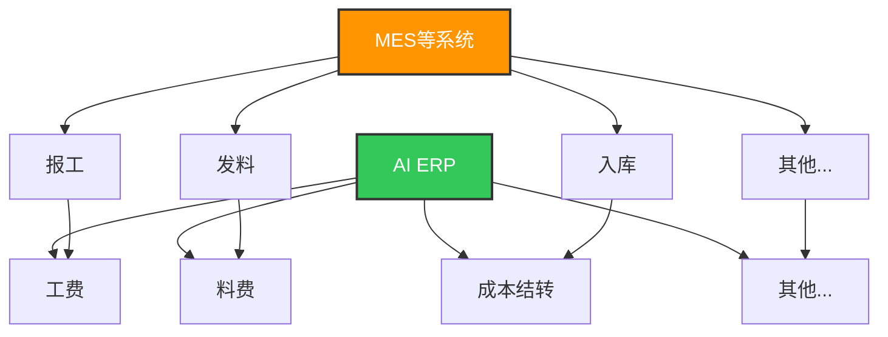
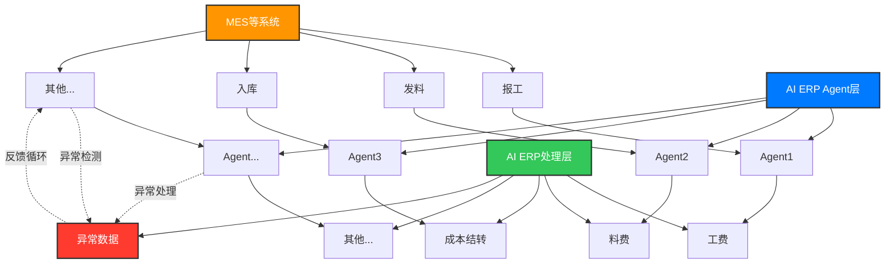
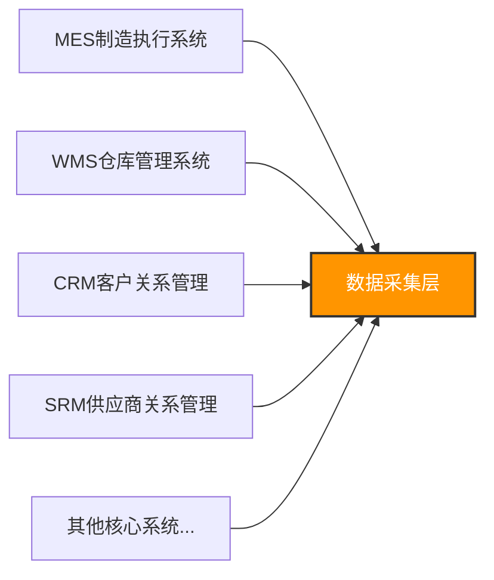
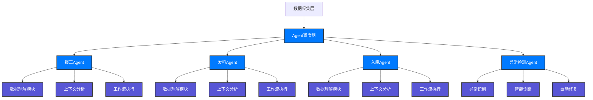
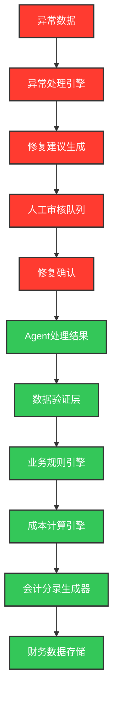

# AI ERP 数据集成架构设计

## 🎯 架构概述

AI ERP系统采用智能数据集成架构，通过Agent代理模式实现从传统ERP向AI增强型ERP的演进，专注于与企业核心系统进行深度集成，提供智能化的数据处理能力。

## 📊 架构演进对比

### 传统数据流架构



**特点：**
- 简单直接的数据传输
- 一对一映射关系
- 缺乏智能处理能力
- 异常数据难以处理

### AI增强数据流架构



**特点：**
- 引入Agent代理层进行智能处理
- 支持异常数据检测和处理
- 实现反馈循环机制
- 具备机器学习能力

## 🏗️ 详细技术架构

### 1. 数据源层 (Source Layer)



**核心系统集成：**
- **MES系统**：报工、发料、入库等制造数据
- **WMS系统**：库存、出入库、盘点等仓储数据
- **CRM系统**：客户、订单、销售等业务数据
- **SRM系统**：供应商、采购、合同等采购数据

### 2. AI Agent代理层 (Agent Layer)



**Agent核心能力：**

#### 2.1 数据理解模块
- **语义解析**：理解原始数据的业务含义
- **上下文关联**：建立数据间的关联关系
- **格式标准化**：统一不同系统的数据格式

#### 2.2 智能工作流执行
- **自动会计处理**：根据业务规则自动生成会计分录
- **成本计算**：智能计算工费、料费等成本
- **异常处理**：自动识别和处理异常数据

#### 2.3 异常检测与处理
- **实时监控**：持续监控数据质量
- **异常识别**：基于ML模型识别异常模式
- **自动修复**：尝试自动修复常见异常
- **人工介入**：复杂异常转人工处理

### 3. 数据处理层 (Processing Layer)



## 🔧 技术实现方案

### 1. 核心技术栈

```yaml
AI引擎:
  - 机器学习: scikit-learn, pandas
  - 深度学习: PyTorch, TensorFlow
  - 自然语言处理: transformers, spaCy
  - 规则引擎: Drools (JPype集成)

数据集成:
  - 消息队列: Redis, RabbitMQ
  - 数据同步: Apache Kafka
  - API网关: FastAPI, Nginx
  - 数据库: MongoDB, SQLite, MySQL

微服务架构:
  - 服务发现: Consul
  - 配置管理: etcd
  - 监控告警: Prometheus, Grafana
  - 日志管理: ELK Stack
```

### 2. Agent实现架构

```python
# Agent基础框架
class BaseAgent:
    def __init__(self, agent_type: str):
        self.agent_type = agent_type
        self.ml_model = None
        self.rule_engine = None
        
    async def process_data(self, raw_data: Dict) -> ProcessingResult:
        # 1. 数据理解
        understood_data = await self.understand_data(raw_data)
        
        # 2. 上下文分析
        context = await self.analyze_context(understood_data)
        
        # 3. 工作流执行
        result = await self.execute_workflow(context)
        
        return result
    
    async def understand_data(self, data: Dict) -> Dict:
        """使用ML和NLP理解数据含义"""
        pass
    
    async def analyze_context(self, data: Dict) -> Dict:
        """分析数据上下文和关联关系"""
        pass
    
    async def execute_workflow(self, context: Dict) -> ProcessingResult:
        """执行具体的业务工作流"""
        pass

# 报工Agent实现
class WorkReportAgent(BaseAgent):
    def __init__(self):
        super().__init__("work_report")
        self.cost_calculator = CostCalculator()
        self.accounting_generator = AccountingGenerator()
    
    async def execute_workflow(self, context: Dict) -> ProcessingResult:
        # 计算工费
        labor_cost = await self.cost_calculator.calculate_labor_cost(
            context['work_hours'], 
            context['employee_rate']
        )
        
        # 生成会计分录
        accounting_entries = await self.accounting_generator.generate_entries(
            'labor_cost', 
            labor_cost, 
            context
        )
        
        return ProcessingResult(
            labor_cost=labor_cost,
            accounting_entries=accounting_entries,
            status='success'
        )
```

### 3. 异常检测与处理

```python
class ExceptionDetectionAgent(BaseAgent):
    def __init__(self):
        super().__init__("exception_detection")
        self.anomaly_model = load_anomaly_detection_model()
        self.rule_engine = DroolsEngine()
    
    async def detect_exceptions(self, data: List[Dict]) -> List[Exception]:
        exceptions = []
        
        for item in data:
            # 1. 基于规则的异常检测
            rule_exceptions = await self.rule_engine.check_rules(item)
            
            # 2. 基于ML的异常检测
            ml_score = self.anomaly_model.predict(item)
            if ml_score > 0.8:
                ml_exceptions = [MLException(item, ml_score)]
            else:
                ml_exceptions = []
            
            exceptions.extend(rule_exceptions + ml_exceptions)
        
        return exceptions
    
    async def auto_fix_exceptions(self, exceptions: List[Exception]) -> List[FixResult]:
        fix_results = []
        
        for exception in exceptions:
            if exception.fixable:
                fix_result = await exception.auto_fix()
                fix_results.append(fix_result)
            else:
                # 转人工处理
                await self.send_to_human_review(exception)
        
        return fix_results
```

## 📈 系统优势

### 1. 深度集成 vs 浅层集成

**传统ERP：**
- 支持数百种集成接口
- 质量参差不齐
- 简单数据传输
- 缺乏智能处理

**AI ERP：**
- 专注核心系统深度集成
- 统一质量标准
- 智能数据理解和处理
- 自动化工作流执行

### 2. 智能化处理能力

- **语义理解**：理解数据的业务含义和上下文
- **自动学习**：基于历史数据持续优化处理逻辑
- **异常处理**：智能识别和处理异常情况
- **反馈循环**：异常数据自动反馈到源系统

### 3. 业务价值

- **提高准确性**：减少人工错误和遗漏
- **降低成本**：自动化处理减少人力成本
- **提升效率**：实时处理和响应
- **增强可靠性**：异常检测和自动修复

## 🚀 实施路径

### 阶段1：基础架构搭建
1. 搭建Agent框架
2. 实现核心Agent（报工、发料、入库）
3. 建立数据流通道

### 阶段2：智能化增强
1. 集成机器学习模型
2. 实现异常检测
3. 建立反馈机制

### 阶段3：全面优化
1. 扩展更多Agent类型
2. 优化算法模型
3. 完善监控告警

## 📊 监控与运维

### 关键指标监控
- **数据处理量**：每小时/每日处理的数据量
- **处理成功率**：正常处理的数据比例
- **异常检测率**：异常数据的识别率
- **自动修复率**：异常数据的自动修复比例
- **响应时间**：从数据接收到处理完成的时间

### 告警机制
- **实时告警**：异常数据实时推送
- **趋势告警**：处理成功率下降告警
- **容量告警**：系统负载过高告警

---

*本文档基于AI ERP系统的实际架构设计，体现了从传统ERP向智能化ERP的演进路径。*
